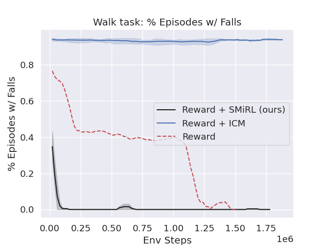
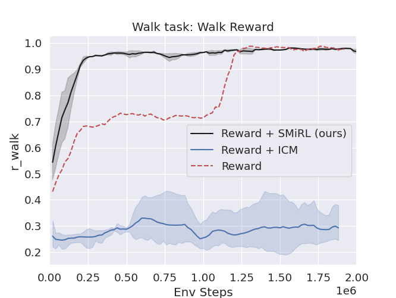
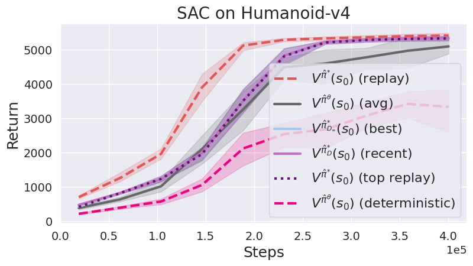

# Research Tools

Plotting scripts for RL experiments. Includes biped locomotion results (SMiRL vs ICM) and SAC return-analysis plots across several environments.

## Results

### Walk Task: % Episodes with Falls

Lower is better — SMiRL quickly stabilises the agent and eliminates falls, while ICM and the vanilla reward baseline continue to fall throughout training.



### Walk Task: Walk Reward

Higher is better — SMiRL achieves near-perfect walk reward early in training and maintains it, whereas ICM plateaus at a much lower level.



## SAC Return Analysis

`make_plots_SAC.py` plots six return estimates across training for SAC agents, following the `make_plots_SAC.py` + `make_plots.py` pattern.

### Humanoid-v4



## Setup

Requires [uv](https://docs.astral.sh/uv/).

```bash
# Install dependencies
uv sync

# Biped locomotion plots (saves file0.png/svg/pdf and file1.png/svg/pdf)
uv run python plot_biped.py

# SAC return-analysis plots (saves to data/<title>.png/svg/pdf)
uv run python make_plots_SAC.py
```

## Methods

### Biped locomotion (`plot_biped.py`)

| Label | Description |
|-------|-------------|
| **Reward + SMiRL (ours)** | Task reward combined with SMiRL intrinsic motivation (entropy minimisation over observed states) |
| **Reward + ICM** | Task reward combined with Intrinsic Curiosity Module |
| **Reward** | Task reward only (vanilla RL baseline) |

### SAC return analysis (`make_plots_SAC.py`)

| Label | Description |
|-------|-------------|
| **V(s₀) (avg)** | Mean episodic return of the current policy |
| **V(s₀) (deterministic)** | Return of the deterministic (greedy) policy |
| **V(s₀) (best)** | Best return seen across all replay data globally |
| **V(s₀) (recent)** | Best return seen in the most recent replay buffer |
| **V(s₀) (replay)** | Average return over all replay buffer episodes |
| **V(s₀) (top replay)** | Average return over the top-k replay buffer episodes |

## Data

- `safe.csv` — per-episode training logs for the biped experiments
- `data/*.csv` — WandB exports for SAC experiments, one file per environment

## References

- [rlplot](https://github.com/mantle2048/rlplot) — additional plot styles and utilities for RL research papers
